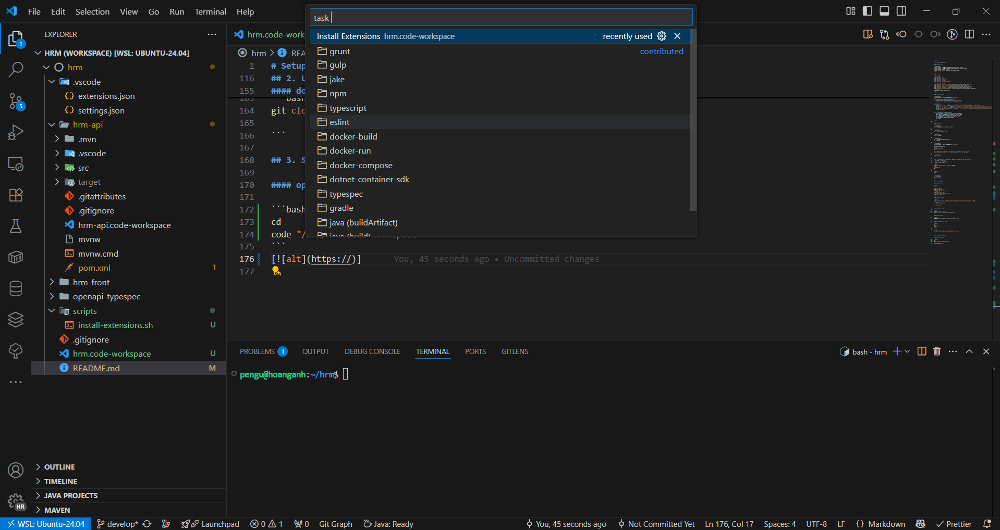

# Setup

## 1. Windows PowerShell

#### install apps

```powershell
winget install --id Microsoft.Powershell --source winget
winget install --id Microsoft.Powershell.Preview --source winget
winget install Postman.Postman
winget install -e --id Microsoft.VisualStudioCode
# end
```

#### vs code

```powershell
code --profile "hrm"
code --profile "hrm-front"
code --profile "hrm-api"
code --profile "openapi-typespec"

# wsl extension install
code --profile "Default" --install-extension ms-vscode-remote.remote-wsl
code --profile "hrm" --install-extension ms-vscode-remote.remote-wsl
code --profile "hrm-front" --install-extension ms-vscode-remote.remote-wsl
code --profile "hrm-api" --install-extension ms-vscode-remote.remote-wsl
code --profile "openapi-typespec" --install-extension ms-vscode-remote.remote-wsl
# vscode exit
Stop-Process -Name code -Force
# end
```

#### create shortcut

```powershell
$shortcutFolder = "$env:USERPROFILE\Desktop\hrm"

if (!(Test-Path -Path $shortcutFolder)) {
    New-Item -Path $shortcutFolder -ItemType Directory
}

$shortcuts = @(
    @{ Name = "hrm.lnk"; Arguments = "/c wsl code ~/hrm/hrm.code-workspace --profile hrm" },
    @{ Name = "hrm-front.lnk"; Arguments = "/c wsl code ~/hrm/hrm-front/hrm-front.code-workspace --profile hrm-front" },
    @{ Name = "hrm-api.lnk"; Arguments = "/c wsl code ~/hrm/hrm-api/hrm-api.code-workspace --profile hrm-api" },
    @{ Name = "openapi-typespec.lnk"; Arguments = "/c wsl code ~/hrm/openapi-typespec/openapi-typespec.code-workspace --profile openapi-typespec" }
)

foreach ($shortcut in $shortcuts) {
    $shortcutPath = "$shortcutFolder\$($shortcut.Name)"
    $WScriptShell = New-Object -ComObject WScript.Shell
    $sc = $WScriptShell.CreateShortcut($shortcutPath)
    $sc.TargetPath = "C:\Windows\System32\cmd.exe"
    $sc.Arguments = $shortcut.Arguments
    $sc.Save()
}
# end
```

#### install wsl

```powershell
wsl --unregister [distribution name]
```

```powershell
wsl --install Ubuntu-24.04
```

```powershell
Restart-Computer
```

```powershell
wsl --set-default Ubuntu-24.04
wsl --update
```

```powershell
$wslConfigPath = "$env:USERPROFILE\.wslconfig"

$wslConfigContent = @"
[wsl2]
dnsTunneling=true
"@

$wslConfigContent | Out-File -FilePath $wslConfigPath -Encoding utf8
```

```powershell
wsl
```

Since a username and password are required, please set them as follows:
| username | password |
| ---------- | ---------- |
| pengu | (any value) |

```bash
sudo tee /etc/wsl.conf > /dev/null <<EOF
[boot]
systemd=true
EOF
```

```bash
exit
```

```powershell
wsl --shutdown
wsl
```

## 2. Linux Ubuntu

#### install tools

```bash
cd

sudo apt update
sudo apt upgrade -y
sudo apt install git -y
# github cli
sudo apt install gh -y
# vscode extensions auto install
sudo apt install jq -y
```

#### install nodejs

```bash
curl -o- https://raw.githubusercontent.com/nvm-sh/nvm/v0.40.3/install.sh | bash

\. "$HOME/.nvm/nvm.sh"

nvm install 22
```

#### install mvn jdk

```bash
sudo apt install maven -y
sudo apt install openjdk-21-jre-headless -y
```

#### github login

```bash
BROWSER=/mnt/c/Windows/explorer.exe gh auth login
```

#### download source code

```bash
cd
mkdir hrm
cd hrm
```

```bash
git clone https://github.com/ndha1511/hrm-dev.git .

```

## 3. Setup environment

#### open workspace

```bash
cd
code "/hrm/hrm.code-workspace"
```


