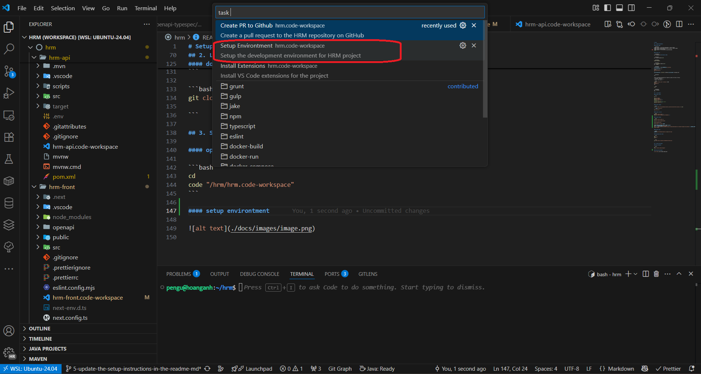

# Setup

## 1. Windows PowerShell

#### install apps

```powershell
winget install --id Microsoft.Powershell --source winget
winget install --id Microsoft.Powershell.Preview --source winget
winget install Postman.Postman
winget install -e --id Microsoft.VisualStudioCode
# end
```

#### install wsl

```powershell
wsl --unregister [distribution name]
```

```powershell
wsl --install Ubuntu-24.04
```

```powershell
Restart-Computer
```

```powershell
wsl --set-default Ubuntu-24.04
wsl --update
```

```powershell
$wslConfigPath = "$env:USERPROFILE\.wslconfig"

$wslConfigContent = @"
[wsl2]
dnsTunneling=true
"@

$wslConfigContent | Out-File -FilePath $wslConfigPath -Encoding utf8
```

```powershell
wsl
```

Since a username and password are required, please set them as follows:
| username | password |
| ---------- | ---------- |
| pengu | (any value) |

```bash
sudo tee /etc/wsl.conf > /dev/null <<EOF
[boot]
systemd=true
EOF
```

```bash
exit
```

```powershell
wsl --shutdown
wsl
```

## 2. Linux Ubuntu

#### install tools

```bash
cd

sudo apt update
sudo apt upgrade -y
sudo apt install git -y
# github cli
sudo apt install gh -y
# vscode extensions auto install
sudo apt install jq -y
```

#### install nodejs

```bash
curl -o- https://raw.githubusercontent.com/nvm-sh/nvm/v0.40.3/install.sh | bash

\. "$HOME/.nvm/nvm.sh"

nvm install 22
```

#### install mvn jdk

```bash
sudo apt install maven -y
sudo apt install openjdk-21-jre-headless -y
```

#### install docker

```bash
sudo apt install docker.io

sudo apt install docker-buildx

sudo groupadd docker

sudo usermod -aG docker $USER

DOCKER_CONFIG=${DOCKER_CONFIG:-$HOME/.docker}
mkdir -p $DOCKER_CONFIG/cli-plugins
curl -SL https://github.com/docker/compose/releases/download/v2.37.3/docker-compose-linux-x86_64 -o $DOCKER_CONFIG/cli-plugins/docker-compose
```

#### github login

```bash
BROWSER=/mnt/c/Windows/explorer.exe gh auth login
```

#### download source code

```bash
cd
mkdir hrm
cd hrm
```

```bash
git clone https://github.com/ndha1511/hrm-dev.git .

```

## 3. Setup environment

#### open workspace

```bash
cd
code "/hrm/hrm.code-workspace"
```

#### setup environtment



#### install extensions


